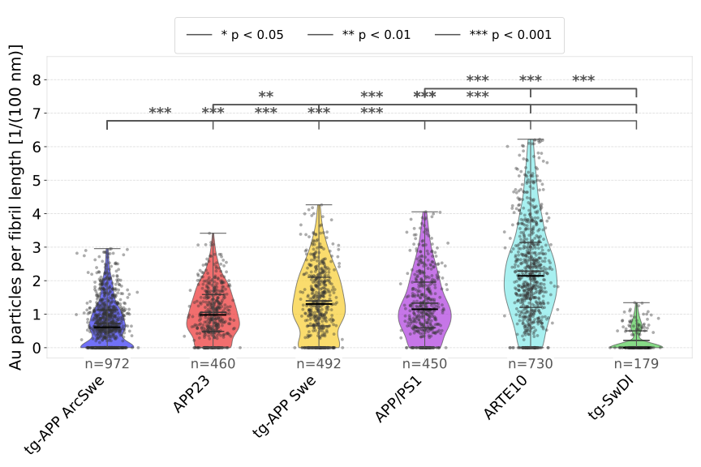

# Filament Particle Co-localization Analysis
This documentation describes a workflow for quantifying and comparing antibody binding to amyloid fibrils using immunogold-labeled transmission electron microscopy (TEM) images.

## Example of an annotated output:

## Comparison of bound particles per fibril length scores across datasets:
